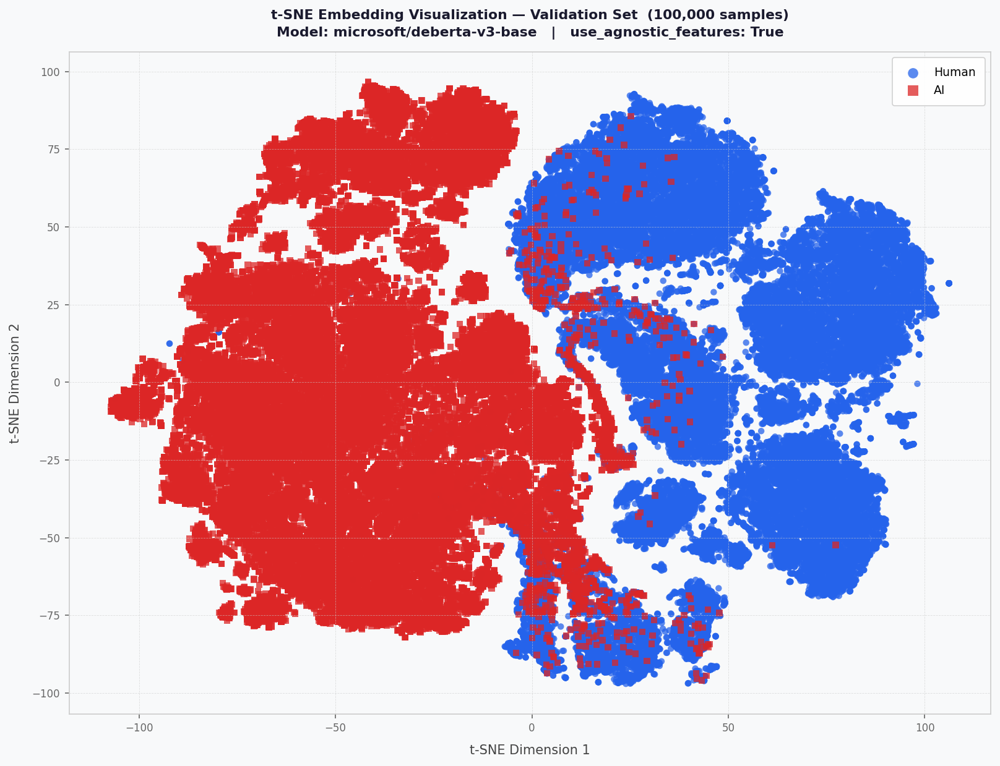
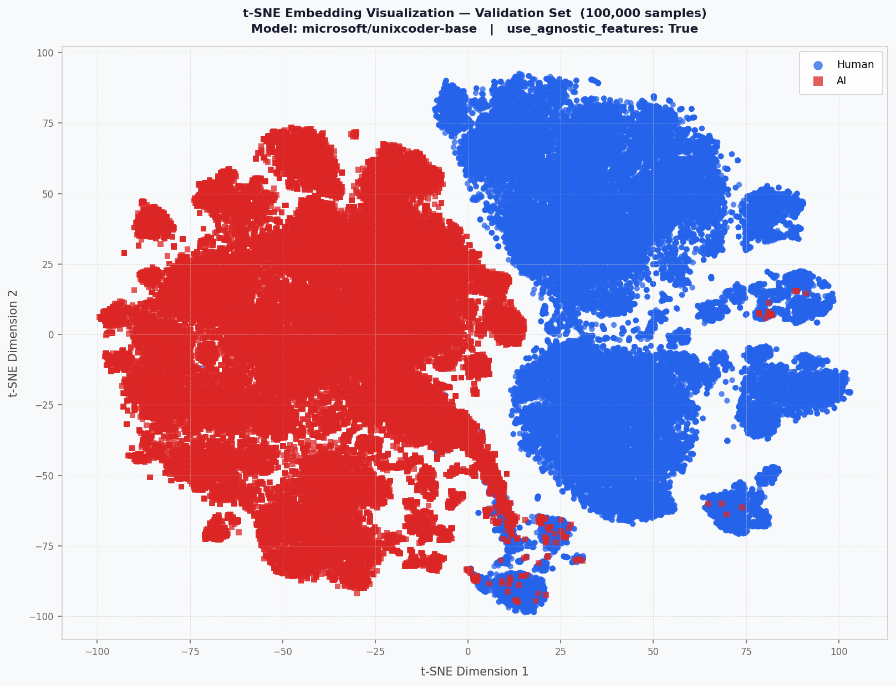
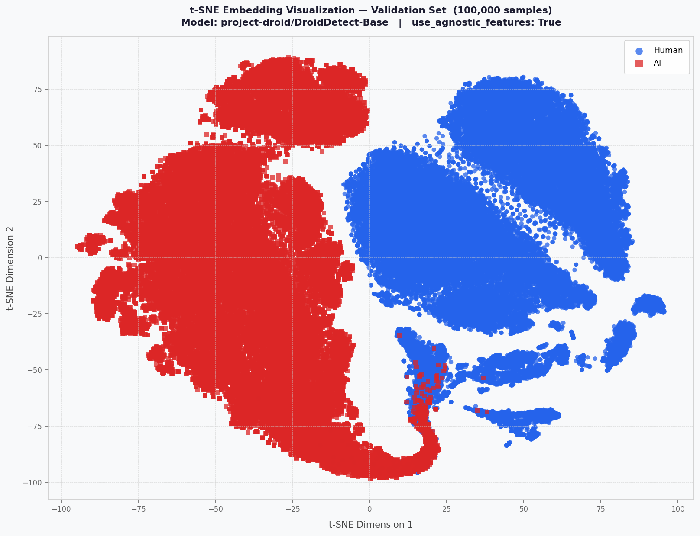
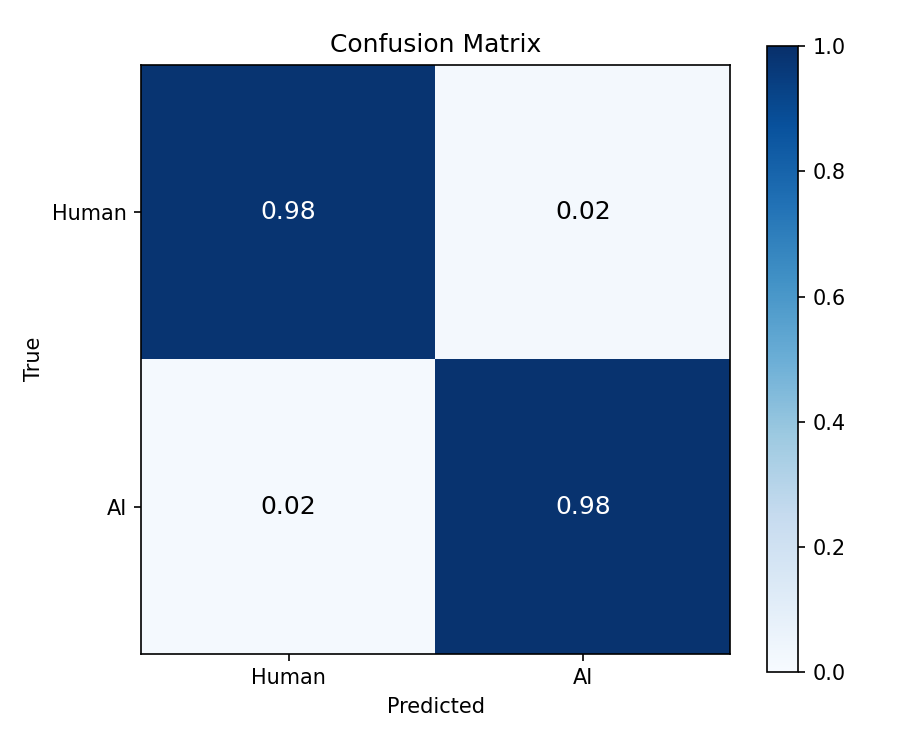
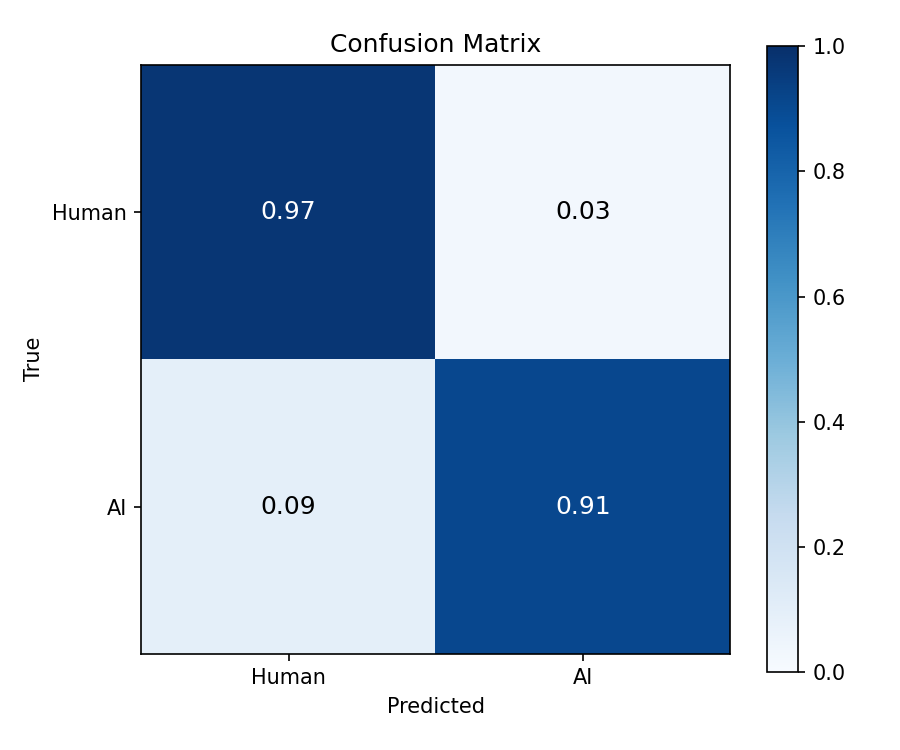

# Human vs AI Code Detection — SemEval-2026 Task 13, Subtask A
## 1. Tổng Quan Bài Toán

**SemEval-2026 Task 13 — Subtask A: Generalization** yêu cầu xây dựng mô hình **phân loại nhị phân** phân biệt:

- **Label 0**: Code do AI/máy sinh ra
- **Label 1**: Code do con người viết

Thách thức cốt lõi là khả năng **generalization**: mô hình được huấn luyện trên C++, Python, Java (domain thuật toán) nhưng phải hoạt động tốt trên các ngôn ngữ và domain chưa từng thấy.

| Setting | Ngôn ngữ | Domain |
|---|---|---|
| Seen Languages & Seen Domains | C++, Python, Java | Algorithmic |
| Unseen Languages & Seen Domains | Go, PHP, C#, C, JS | Algorithmic |
| Seen Languages & Unseen Domains | C++, Python, Java | Research, Production |
| Unseen Languages & Domains | Go, PHP, C#, C, JS | Research, Production |

---

## 2. Kiến Trúc Tổng Thể

Dự án triển khai **hai chiến lược mô hình độc lập**:

### 2.1 HybridClassifier (`model_type: hybrid`)

Kết hợp semantic embedding từ Transformer với 11 stylometric features thủ công.

```
Input Code
    │
    ├─── [UniXcoder / DeBERTa-v3-base]
    │         └─── Attention Pooler ──────────────┐
    │                                             ▼
    └─── AgnosticFeatureExtractor (11 feats)     [Concat]
              └──── FeatureGatingNetwork ──────────┘
                                                   │
                                         Binary Classifier
                                                   │
                                          Human / AI Generated
```

**Backbone được hỗ trợ:** `microsoft/unixcoder-base`, `microsoft/deberta-v3-base`

### 2.2 TLModel — Transfer Learning (`model_type: droiddetect`)

Fine-tune `project-droid/DroidDetect-Base` (pretrained trên code classification) bằng cách load encoder weights từ checkpoint pretrained lên kiến trúc `ModernBERT-base`, sau đó fine-tune nhị phân.

```
Input Code
    │
    [ModernBERT-base (khởi tạo từ DroidDetect-Base encoder)]
    │         └─── Mean Pooling hoặc Attention Pooler
    │                   └─── text_projection ──────────────┐
    │                                                      ▼
    └─── (Optional) AgnosticFeatures                     Classifier
              └──── FeatureGatingNetwork ──────────────────┘
```

---

## 3. Kết quả

Metrics tốt nhất trên tập validation (val F1-macro):

| Model | `use_agnostic_features` | Best Epoch | Val Loss | Val Accuracy | Val F1-macro | Private Test Acc |
|-------|------------------------|------------|----------|--------------|--------------|-----------------|
| deberta-v3-base  | `false` | 14 | 0.05689 | 98.43% | 98.42% | 0.44582 |
| deberta-v3-base  | `true`  | 4  | 0.29193 | 94.10% | 94.10% | 0.28879 |
| droiddetect-base | `false` | 3  | 0.01351 | 99.58% | 99.58% | **0.68569** |
| droiddetect-base | `true`  | 3  | 0.01147 | 99.68% | **99.68%** | 0.52373 |
| unixcoder-base   | `false` | 1  | 0.20948 | 96.18% | 96.18% | 0.27839 |
| unixcoder-base   | `true`  | 10  | 0.06261 | 99.49% | 99.49% | 0.22140 |

> DroidDetect-Base (`use_agnostic_features=false`) đạt kết quả tốt nhất trên private test với **Accuracy = *0.68569**.

---

### 3.1 Feature Visualization with t-SNE

Embeddings từ validation set của từng model được chiếu xuống 2D bằng t-SNE (perplexity=30, n\_iter=1000).

<table>
  <tr>
    <td></td>
    <td align="center"><b>DeBERTa-v3-base</b></td>
    <td align="center"><b>DroidDetect-base</b></td>
    <td align="center"><b>UniXcoder-base</b></td>
  </tr>

  <!-- agnostic = false -->
  <tr>
    <td align="center"><b><code>agnostic=false</code></b></td>
    <td></td>
    <td></td>
    <td></td>
  </tr>

  <!-- agnostic = true -->
  <tr>
    <td align="center"><b><code>agnostic=true</code></b></td>
    <td></td>
    <td></td>
    <td></td>
  </tr>
</table>

### 3.2 Confusion Matrices

<table>
  <tr>
    <td></td>
    <td align="center"><b>DeBERTa-v3-base</b></td>
    <td align="center"><b>DroidDetect-base</b></td>
    <td align="center"><b>UniXcoder-base</b></td>
  </tr>

  <!-- agnostic = false -->
  <tr>
    <td align="center"><b><code>agnostic=false</code></b></td>
    <td></td>
    <td></td>
    <td></td>
  </tr>

  <!-- agnostic = true -->
  <tr>
    <td align="center"><b><code>agnostic=true</code></b></td>
    <td></td>
    <td></td>
    <td></td>
  </tr>
</table>

---

## 4. Cấu trúc thư mục

```
human-ai-detection/
├── config/
│   ├── config_hybrid.yaml        # Config cho DeBERTa-v3 / UniXcoder (Hybrid)
│   └── config_droiddetect.yaml   # Config cho DroidDetect-Base
├── dataset/
│   ├── dataset.py                # AgnosticDataset, SimpleTextDataset
│   ├── preprocess_features.py    # AgnosticFeatureExtractor (11 stylometric features)
│   └── Inference_dataset.py
├── models/
│   └── model.py                  # HybridClassifier, TLModel, build_model
├── utils/
│   ├── __init__.py
│   └── utils.py
├── results/
│   ├── unixcoder-base/           # Kết quả UniXcoder
│   ├── droiddetect-base/         # Kết quả DroidDetect (3 runs)
│   └── deberta-v3-base/          # Kết quả DeBERTa-v3
├── submission/                   # File CSV nộp leaderboard
├── data/
│   ├── Task_A/                   # Raw parquet files (train/val/test)
│   └── Task_A_Processed/         # Parquet với agnostic_features đã tính sẵn
├── train.py
├── inference.py
├── visualize.py
├── requirements.txt
└── environment.yml
```

---

## 5. Cài đặt môi trường

**Dùng conda (khuyến nghị):**
```bash
conda env create -f environment.yml
conda activate nina
```

**Hoặc dùng pip:**
```bash
pip install -r requirements.txt
# Cài PyTorch với CUDA 12.1 riêng nếu cần:
pip install torch==2.5.1+cu121 torchaudio==2.5.1+cu121 torchvision==0.20.1+cu121 \
    --index-url https://download.pytorch.org/whl/cu121
```

---

## 6. Hướng Dẫn Chạy Nhanh

```bash
# 1. Chuẩn bị features (chạy 1 lần, ~30 phút)
python -m dataset.preprocess_features

# 2. Train — DroidDetect (best model)
python train.py --config config/config_droiddetect.yaml --result-dir results/droiddetect/0 --device-id 0

# 3. Train — Hybrid DeBERTa
python train.py --config config/config_hybrid.yaml --result-dir results/deberta/0 --device-id 0

# 4. Inference + submission
python inference.py \
    --test_file data/Task_A/test.parquet \
    --checkpoint_dir results/droiddetect/0/best_model \
    --batch_size 64 --gpu_ids 0 --binary

# 5. Visualize training curves
python visualize.py \
    --checkpoint_dir results/droiddetect/0/best_model \
    --metrics_file results/droiddetect/0/metrics.csv \
    --curves_output_dir results/droiddetect/0/plots
```

**Output:** PNG lưu tại `<checkpoint_dir>/tsne_<split>.png` (hoặc đường dẫn `--output`)  
Embeddings được cache tại `data/Task_A_Embeddings/` để tái sử dụng.

---

