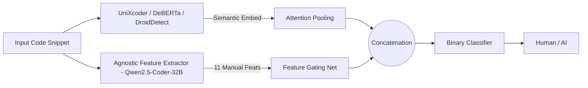

# Human vs AI Code Detection — SemEval-2026 Task 13, Subtask A

Binary classification: phân biệt code do AI sinh ra (`0`) và code do người viết (`1`).

---

## Mục lục

- [Cấu trúc thư mục](#cấu-trúc-thư-mục)
- [Cài đặt môi trường](#cài-đặt-môi-trường)
- [Kiến trúc mô hình](#kiến-trúc-mô-hình)
- [Chuẩn bị dữ liệu](#chuẩn-bị-dữ-liệu)
- [Train](#train)
- [Inference & Submission](#inference--submission)
- [Visualize t-SNE & Training Curves](#visualize-t-sne--training-curves)
- [Kết quả](#kết-quả)

---

## Cấu trúc thư mục

```
human-ai-detection/
├── config/
│   ├── config_hybrid.yaml        # Config cho DeBERTa-v3 / UniXcoder (Hybrid)
│   └── config_droiddetect.yaml   # Config cho DroidDetect-Base
├── dataset/
│   ├── dataset.py                # AgnosticDataset, SimpleTextDataset
│   ├── preprocess_features.py    # AgnosticFeatureExtractor (11 stylometric features)
│   └── Inference_dataset.py
├── models/
│   └── model.py                  # HybridClassifier, TLModel, build_model
├── utils/
│   ├── __init__.py
│   └── utils.py
├── results/
│   ├── unixcoder-base/           # Kết quả UniXcoder
│   ├── droiddetect-base/         # Kết quả DroidDetect (3 runs)
│   └── deberta-v3-base/          # Kết quả DeBERTa-v3
├── submission/                   # File CSV nộp leaderboard
├── data/
│   ├── Task_A/                   # Raw parquet files (train/val/test)
│   └── Task_A_Processed/         # Parquet với agnostic_features đã tính sẵn
├── train.py
├── inference.py
├── visualize.py
├── requirements.txt
└── environment.yml
```

---

## Cài đặt môi trường

**Dùng conda (khuyến nghị):**
```bash
conda env create -f environment.yml
conda activate nina
```

**Hoặc dùng pip:**
```bash
pip install -r requirements.txt
# Cài PyTorch với CUDA 12.1 riêng nếu cần:
pip install torch==2.5.1+cu121 torchaudio==2.5.1+cu121 torchvision==0.20.1+cu121 \
    --index-url https://download.pytorch.org/whl/cu121
```

---

## Kiến trúc mô hình

Dự án hỗ trợ 3 backbone:

| `model_type` | Backbone | Đặc điểm |
|---|---|---|
| `hybrid` | `microsoft/unixcoder-base` hoặc `microsoft/deberta-v3-base` | Kết hợp Attention Pooling + Stylometric features (Feature Gating) |
| `droiddetect` | `project-droid/DroidDetect-Base` | Pretrained trên code phân loại, fine-tune nhị phân |

**Hybrid architecture:**
<!-- ```
Input Code ──> UniXcoder / DeBERTa ──> Attention Pooling ──> [concat] ──> Binary Classifier
                                                                 ↑
              AgnosticFeatureExtractor ──> Feature Gating Net ──┘
              (11 stylometric features: perplexity, identifier entropy,
               consistency score, spacing ratio, human markers, ...)
``` -->


#### ***Loss:*** `Total = FocalLoss + 0.05 × SupConLoss`  
#### ***Augmentation:*** Random crop thay cho truncation cố định.
#### ***Agnostic Feature Extractor:*** Có thể dùng hoặc không để đạt kết quả tốt nhất

---

## Chuẩn bị dữ liệu

Đặt các file parquet vào `data/Task_A/`:
```
data/Task_A/
├── train.parquet
├── val.parquet
└── test.parquet
```

Tính stylometric features (cần ~30 phút, cache kết quả vào `data/Task_A_Processed/`):
```bash
python -m dataset.preprocess_features
```

---

## Train

### Config chính (`config/config_hybrid.yaml` hoặc `config/config_droiddetect.yaml`)

| Tham số | Ý nghĩa |
|---|---|
| `model.model_type` | `hybrid` hoặc `droiddetect` |
| `model.base_model` | Tên HuggingFace model |
| `data.use_agnostic_features` | `true`: fuse stylometric features; `false`: text-only |
| `training.batch_size` | Batch size (default 128) |
| `training.num_epochs` | Số epoch tối đa (default 25) |
| `training.checkpoint_dir` | Thư mục lưu checkpoint |
| `training.early_stop_patience` | Dừng sớm nếu không cải thiện (default 5) |

### Chạy train

**1 GPU:**
```bash
python train.py --config config/config_hybrid.yaml --device-id 0
```

**Multi-GPU (DataParallel):**
```bash
python train.py --config config/config_hybrid.yaml --gpu-ids 0,1,2,3
```

**Chỉ định thư mục output:**
```bash
python train.py --config config/config_droiddetect.yaml --result-dir results/droiddetect-base/0 --device-id 0
```

**Resume từ checkpoint:**
```bash
python train.py --config config/config_hybrid.yaml \
    --resume results/unixcoder-base/last_checkpoint
```

**Output:**
- `results/<checkpoint_dir>/best_model/` — model tốt nhất theo val F1-macro
- `results/<checkpoint_dir>/last_checkpoint/` — checkpoint cuối để resume
- `results/<checkpoint_dir>/metrics.csv` — log metrics mỗi epoch
- `results/<checkpoint_dir>/best_model/confusion_matrix.png` — confusion matrix validation
- `train.log` — log file

---

## Inference & Submission

### Chạy inference trên tập test (có label)
```bash
python inference.py \
    --test_file data/Task_A/val.parquet \
    --checkpoint_dir results/unixcoder-base/best_model \
    --batch_size 64 \
    --gpu_ids 0
```

### Chạy inference để tạo file submission (không có label)
```bash
python inference.py \
    --test_file data/Task_A/test.parquet \
    --checkpoint_dir results/unixcoder-base/best_model \
    --batch_size 64 \
    --gpu_ids 0
```

**Multi-GPU:**
```bash
python inference.py \
    --test_file data/Task_A/test.parquet \
    --checkpoint_dir results/droiddetect-base/2/best_model \
    --batch_size 128 \
    --gpu_ids 0,1,2,3
```

**Binary remapping** (khi model có >2 class, gộp thành Human/AI):
```bash
python inference.py \
    --test_file data/Task_A/test.parquet \
    --checkpoint_dir results/droiddetect-base/2/best_model \
    --batch_size 64 \
    --gpu_ids 0 \
    --binary
```

**Output:**
- Nếu có label: in classification report + confusion matrix + file `*_errors.csv`
- Nếu không có label: `*_predictions.csv` (code, prediction, probabilities)
- Nếu test có cột `ID`: tự động tạo `submission/<model>/submission.csv` theo đường dẫn trong config
- Log ghi vào `inference.log`

### Lấy file submission

File submission được lưu tại đường dẫn `data.submission_path` trong config:
- `config_hybrid.yaml` → `submission/deberta-v3-base/0/submission.csv`
- `config_droiddetect.yaml` → `submission/droiddetect/0/submission.csv`

Để đổi đường dẫn submission, sửa trong config:
```yaml
data:
  submission_path: "submission/my_run/submission.csv"
```

---

## Visualize t-SNE & Training Curves

### Vẽ training curves từ metrics.csv
```bash
python visualize.py \
    --checkpoint_dir results/unixcoder-base/best_model \
    --metrics_file results/unixcoder-base/metrics.csv \
    --curves_output_dir results/unixcoder-base/plots
```

Output: `loss_curves.png`, `accuracy_curve.png`, `f1_curve.png`

### Vẽ t-SNE cho tập validation
```bash
python visualize.py \
    --checkpoint_dir results/unixcoder-base/best_model \
    --split val \
    --batch_size 32 \
    --perplexity 30 \
    --n_iter 1000 \
    --device_id 0
```

### Vẽ t-SNE với màu theo ngôn ngữ lập trình
```bash
python visualize.py \
    --checkpoint_dir results/unixcoder-base/best_model \
    --split val \
    --color_by_language \
    --device_id 0
```

### Vẽ t-SNE với file dữ liệu tùy chỉnh
```bash
python visualize.py \
    --checkpoint_dir results/unixcoder-base/best_model \
    --data_file data/Task_A_Processed/val_processed_qwen2_5_coder_32b.parquet \
    --output results/unixcoder-base/tsne_custom.png \
    --max_samples 5000 \
    --device_id 0
```

**Output:** PNG lưu tại `<checkpoint_dir>/tsne_<split>.png` (hoặc đường dẫn `--output`)  
Embeddings được cache tại `data/Task_A_Embeddings/` để tái sử dụng.

---

## Kết quả

Metrics tốt nhất trên tập validation (val F1-macro):

| Model | `use_agnostic_features` | Best Epoch | Val Loss | Val Accuracy | Val F1-macro | Private Test Acc |
|-------|------------------------|------------|----------|--------------|--------------|-----------------|
| deberta-v3-base  | `false` | 14 | 0.05689 | 98.43% | 98.42% | 0.44582 |
| deberta-v3-base  | `true`  | 4  | 0.29193 | 94.10% | 94.10% | 0.28879 |
| droiddetect-base | `false` | 3  | 0.01351 | 99.58% | 99.58% | **0.68569** |
| droiddetect-base | `true`  | 3  | 0.01147 | 99.68% | **99.68%** | 0.52373 |
| unixcoder-base   | `false` | 1  | 0.20948 | 96.18% | 96.18% | 0.27839 |
| unixcoder-base   | `true`  | 10  | 0.06261 | 99.49% | 99.49% | 0.22140 |

> DroidDetect-Base (`use_agnostic_features=false`) đạt kết quả tốt nhất trên private test với **Accuracy = *0.68569**.

---

### Feature Visualization with t-SNE

Embeddings từ validation set của từng model được chiếu xuống 2D bằng t-SNE (perplexity=30, n\_iter=1000).

<table>
  <tr>
    <td align="center"><b>DeBERTa-v3-base<br><code>agnostic=false</code></b></td>
    <td align="center"><b>DeBERTa-v3-base<br><code>agnostic=true</code></b></td>
    <td align="center"><b>DroidDetect-base<br><code>agnostic=false</code></b></td>
  </tr>
  <tr>
    <td></td>
    <td></td>
    <td></td>
  </tr>
  <tr>
    <td align="center"><b>DroidDetect-base<br><code>agnostic=true</code></b></td>
    <td align="center"><b>UniXcoder-base<br><code>agnostic=false</code></b></td>
    <td align="center"><b>UniXcoder-base<br><code>agnostic=true</code></b></td>
  </tr>
  <tr>
    <td></td>
    <td></td>
    <td></td>
  </tr>
</table>

### Confusion Matrices

<table>
  <tr>
    <td align="center"><b>DeBERTa-v3-base<br><code>agnostic=false</code></b></td>
    <td align="center"><b>DeBERTa-v3-base<br><code>agnostic=true</code></b></td>
    <td align="center"><b>DroidDetect-base<br><code>agnostic=false</code></b></td>
  </tr>
  <tr>
    <td></td>
    <td></td>
    <td></td>
  </tr>
  <tr>
    <td align="center"><b>DroidDetect-base<br><code>agnostic=true</code></b></td>
    <td align="center"><b>UniXcoder-base<br><code>agnostic=false</code></b></td>
    <td align="center"><b>UniXcoder-base<br><code>agnostic=true</code></b></td>
  </tr>
  <tr>
    <td></td>
    <td></td>
    <td></td>
  </tr>
</table>
